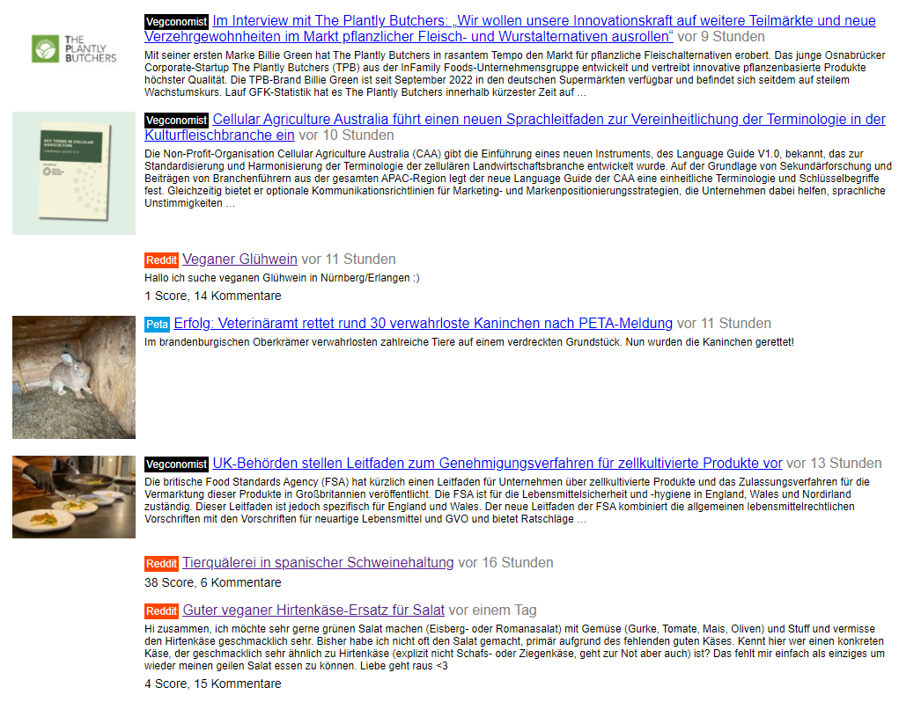

# Veganposts

Zeigt neueste Posts und Nachrichten verschiedener Quellen an, mehr kann leicht dazugebaut werden:

**Reddit**: r/veganDE, r/veganAT 
**Feddit**: vegan, kreisvegs 
**Vegpool** 
**Vegan.at** 
**Vegconomist** 
**Peta** 
**Proveg** 
**VeganNews** 

Die Seite aktualisiert sich alle 3 Minuten automatisch, hat einen Darkmode und ist responsiv.

## Wo gehostet?

<a href="https://veganposts.pages.dev">https://veganposts.pages.dev</a> (Gehostet per Cloudflare Pages)

## Selbst hosten

Kann easy selbst gehostet werden, da primär nur die `index.html` relevant ist. Die HTTP Requests an die Quellen macht der Client selbst per Javascript. 

Nur für die Fälle, bei denen CORS umgangen werden muss, ist ein Backend zwischengeschaltet. Dazu findet sich im functions-Ordner minimaler Code für Cloudflare Pages Functions. Und ein PHP-Beispiel.

Die package.json hat `wrangler` um Cloudflare Pages lokal zu testen.

Einen lokalen dev-Server kann man per `npx wrangler pages dev .` starten.